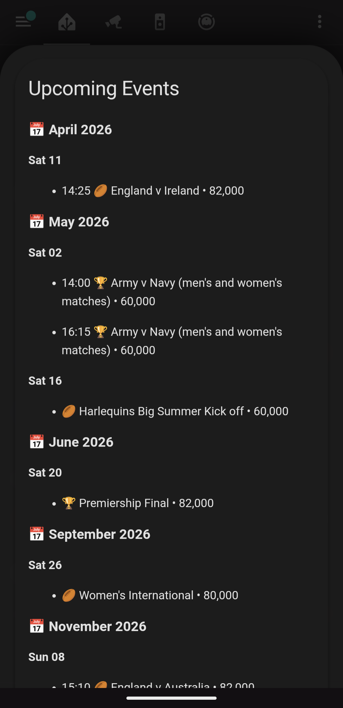

# Twickenham Events

[](https://www.python.org/downloads/)
[](https://opensource.org/licenses/MIT)
[](https://github.com/astral-sh/ruff)

MQTT publishing of Twickenham Stadium events for Home Assistant as well as ICS creation with web server. Scrapes public event pages, normalizes data, publishes retained topics, and advertises a device via Home Assistant discovery. Optional AI processing shortens event names and suggests types.

---

## Table of Contents

1. [Features](#features)
2. [Prerequisites](#prerequisites)
3. [Installation](#installation)
4. [Configuration](#configuration)
5. [Usage](#usage)
6. [MQTT Topics](#mqtt-topics)
7. [Home Assistant Discovery](#home-assistant-discovery)
8. [AI Processing](#ai-processing)
9. [Docker Deployment](#docker-deployment)
10. [Testing](#testing)
11. [Development](#development)
12. [Troubleshooting](#troubleshooting)
13. [Contributing](#contributing)
14. [Home Assistant Cards](#home-assistant-cards)
15. [License](#license)

---

## Features

- Unified device discovery (single retained JSON with entities map)
- Retained topics: status, all_upcoming, next, today
- Availability topic and Last Will support
- Optional AI event processing (shortening, type hints) with on-disk cache
- ICS calendar export (optional)
- Built-in web server for calendar and event endpoints
- CLI service loop with command topics (refresh, clear_cache)

## Prerequisites

- Python 3.11+
- Poetry
- MQTT broker (for Home Assistant integration)

## Installation

```bash
git clone https://github.com/ronschaeffer/twickenham_events.git
cd twickenham_events
poetry install
# Optional AI extras
poetry install --with ai
```

## Configuration

Copy the example config and set environment variables in `.env`.

```bash
cp config/config.yaml.example config/config.yaml
```

Environment variables (examples):

```bash
MQTT_BROKER_URL=${MQTT_BROKER_URL}
MQTT_BROKER_PORT=${MQTT_BROKER_PORT}
MQTT_CLIENT_ID=${MQTT_CLIENT_ID}
MQTT_USERNAME=${MQTT_USERNAME}
MQTT_PASSWORD=${MQTT_PASSWORD}
GEMINI_API_KEY=${GEMINI_API_KEY}
```

Key config sections (excerpt):

```yaml
mqtt:
  enabled: true
  broker_url: "${MQTT_BROKER_URL}"
  broker_port: "${MQTT_BROKER_PORT}"
  client_id: "${MQTT_CLIENT_ID}"
  auth:
    username: "${MQTT_USERNAME}"
    password: "${MQTT_PASSWORD}"
  topics:
    status: "twickenham_events/status"
    all_upcoming: "twickenham_events/events/all_upcoming"
    next: "twickenham_events/events/next"
    today: "twickenham_events/events/today"
  last_will:
    topic: "twickenham_events/status"
    payload: '{"status":"offline","reason":"unexpected_disconnect"}'
    qos: 1
    retain: true

ai_processor:
  api_key: "${GEMINI_API_KEY}"
  shortening:
    enabled: false
    model: "gemini-2.5-pro"
    max_length: 25
    flags_enabled: true
    cache_enabled: true
  type_detection:
    enabled: false
    cache_dir: "output/cache"

home_assistant:
  enabled: true
  discovery_prefix: "homeassistant"
```

## Usage

Entry point: `twick-events`

```bash
poetry run twick-events scrape      # Scrape only
poetry run twick-events mqtt        # Scrape + publish
poetry run twick-events calendar    # Export ICS/JSON
poetry run twick-events all         # Scrape + MQTT + calendar
poetry run twick-events list        # List all upcoming events
poetry run twick-events next        # Show next upcoming event
poetry run twick-events status      # Show configuration/status
poetry run twick-events service     # Long-running loop
poetry run twick-events validate web    # Validate web server config
poetry run twick-events validate config # Validate full config
```

Command topics (published by Home Assistant buttons):

- twickenham_events/cmd/refresh
- twickenham_events/cmd/clear_cache

Output files are written to `output/` (including `upcoming_events.json`, `scrape_results.json`, optional `twickenham_events.ics`). AI caches are under `output/cache/`.

## MQTT Topics

| Topic                                 | Retained |
| ------------------------------------- | -------- |
| twickenham_events/status              | Yes      |
| twickenham_events/events/all_upcoming | Yes      |
| twickenham_events/events/next         | Yes      |
| twickenham_events/events/today        | Yes      |
| twickenham_events/availability        | Yes      |
| twickenham_events/cmd/refresh         | No       |
| twickenham_events/cmd/clear_cache     | No       |

## Home Assistant Discovery

The service publishes a single device discovery payload to:

```
homeassistant/device/twickenham_events/config
```

Entities include: status, last_run, upcoming, next, today, event_count (optional), refresh (button), clear_cache (button), restart (button), cmd_ack, cmd_result, last_ack, last_result (diagnostics).

## AI Processing

AI features are optional and disabled by default. When enabled, the AI processor:

- Shortens event names within a configurable length budget
- Suggests type hints (e.g., rugby, concert)
- Uses an on-disk cache to avoid repeat API calls

Cache management via CLI:

```bash
poetry run twick-events cache clear
poetry run twick-events cache stats
poetry run twick-events cache reprocess
```

See `docs/AI_PROCESSING.md` for details.

## Docker Deployment

See `docs/DOCKER_DEPLOYMENT_EXAMPLES.md` for Docker run/compose examples and `docs/UNRAID_TEMPLATE_EXAMPLE.md` for Unraid-specific deployment.

### MQTT-aware healthcheck (since v0.3.6)

The container exposes `GET /health/mqtt` on the web server (default port 47478) which returns 200 only when the MQTT publisher is connected to the broker AND has published successfully within a recent window. The Docker `HEALTHCHECK` probes this endpoint, so a real EMQX outage now actually marks the container `unhealthy`.

The staleness window scales with `service_interval_seconds`: `max(900, interval * 1.5)`. So a 4-hour service interval gets a 6-hour grace period (well within a typical scrape cycle), but no cycle ever gets less than 15 minutes — even if you set the interval very low, you still get a meaningful window before the container alarms.

Built on `ha_mqtt_publisher`'s shared [`HealthTracker`](https://github.com/ronschaeffer/ha_mqtt_publisher#health--liveness). The publisher uses raw `paho.mqtt.Client` directly (not the wrapped `MQTTPublisher`) so the tracker is populated manually from `on_connect` / `on_disconnect` callbacks and from `run_cycle` after each successful `publish_events()`.

## Testing

```bash
poetry run pytest
```

## Development

Common Makefile targets:

- make check        -- Lint (no changes)
- make fix          -- Lint and auto-fix
- make format       -- Format code
- make clean        -- Remove caches (`__pycache__`, .pytest_cache, .ruff_cache)
- make test         -- Run tests
- make ci-check     -- Lint + tests

See `docs/DEVELOPMENT.md` for more.

## Troubleshooting

- Validate MQTT/discovery topics with helper scripts
- Confirm a single running instance per MQTT client_id
- For AI issues, verify `${GEMINI_API_KEY}` and use cache commands above

## Contributing

- Run lint and tests before submitting changes
- Open an issue or PR describing the change and any discovery/entity impacts

## License

MIT License (see `LICENSE`).

---

## Additional Documentation

- `docs/DEVELOPMENT.md` -- local development notes and Makefile targets
- `docs/GITHUB_ACTIONS.md` -- CI notes
- `docs/AI_PROCESSING.md` -- AI features, configuration, and cache management
- `docs/WEB_SERVER.md` -- web server setup and configuration
- `docs/DOCKER_DEPLOYMENT_EXAMPLES.md` -- Docker deployment guide
- `docs/UNRAID_TEMPLATE_EXAMPLE.md` -- Unraid container template
- `systemd/README.md` -- deployment with systemd

## Home Assistant Cards

Example Lovelace cards are provided in the `ha_card/` directory.

### Markdown Upcoming Events Card

Full event listing grouped by month, showing date, time, emoji, fixture name, and expected crowd size.

<p align="center">
  
</p>

YAML: [ha_card/md_twickenham_events_upcoming.yaml](ha_card/md_twickenham_events_upcoming.yaml)

### Mushroom Next Event Card

Compact card showing the next upcoming event with country flags, short fixture name, and date.

<p align="center">
  
</p>

YAML: [ha_card/mshrm_twickenham_events_short_card.yaml](ha_card/mshrm_twickenham_events_short_card.yaml)

<!-- BEGIN: ha_cards_list (auto-managed) -->

- md twickenham events upcoming: [ha_card/md_twickenham_events_upcoming.yaml](ha_card/md_twickenham_events_upcoming.yaml)
  - Renders `events_json.by_month[].days[].events[]` with `ev.start_time`, `ev.emoji`, `ev.fixture`, `ev.crowd`.
- mshrm twickenham events short card: [ha_card/mshrm_twickenham_events_short_card.yaml](ha_card/mshrm_twickenham_events_short_card.yaml)
  - Uses `sensor.twickenham_events_next` with flat attributes (date, start_time, fixture_short, emoji, event_index, event_count); state is the full `fixture`.

<!-- END: ha_cards_list -->
